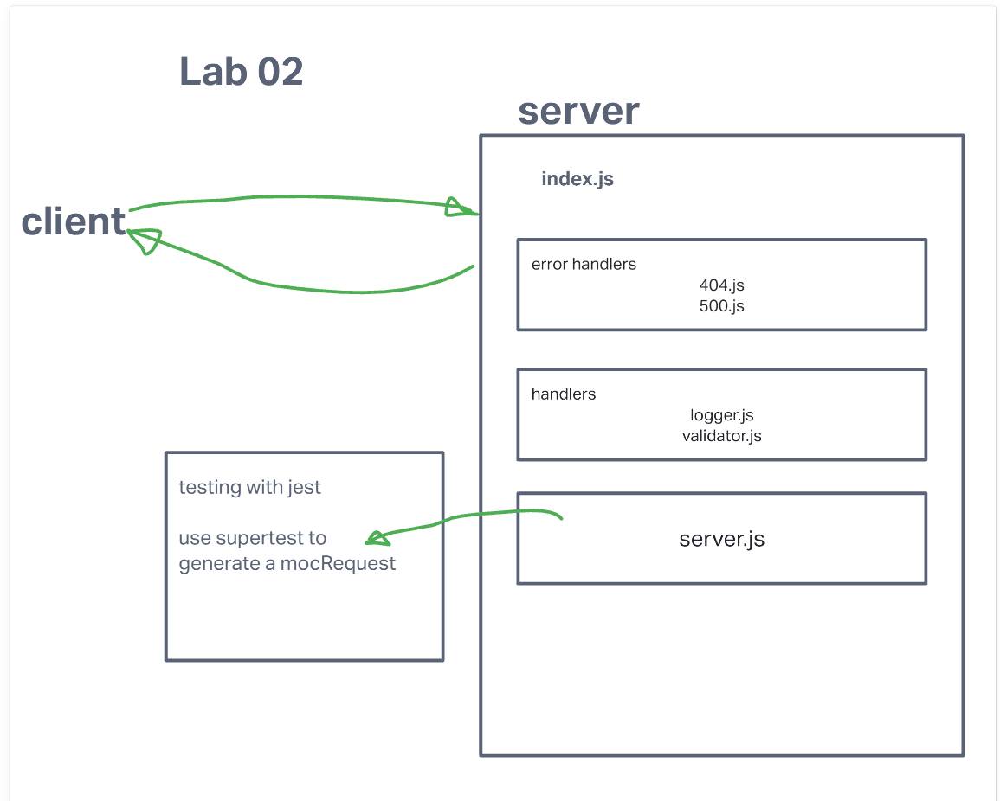

# LAB - Class 02

## Project: basic-express-server

### Author: Marco Villafana, Steve Gant, Brenda Jow

### Problem Domain  

Basic API Server where we write some middleware and practice deployment

### Links and Resources

- [GitHub Actions ci/cd](https://github.com/villafanam/basic-express-server/actions) 
- [back-end server url](http://xyz.com)

### Setup

#### `.env` requirements (where applicable)

for now I have none and do not require one

#### How to initialize/run your application (where applicable)

- e.g. `npm start`

#### How to use your library (where applicable)

#### Features / Routes

- Feature One: We will be building a basic Express server using best practices, including server modularization, use of middleware, and tests.

#### Tests

- `npm test` in terminal to start tests
- tests
  - handle bad route
  - handle bad method (Incomplete)
  - handle no name in query string
  - handle name in query string
  - handle output object is correct (Incomplete)

#### UML

